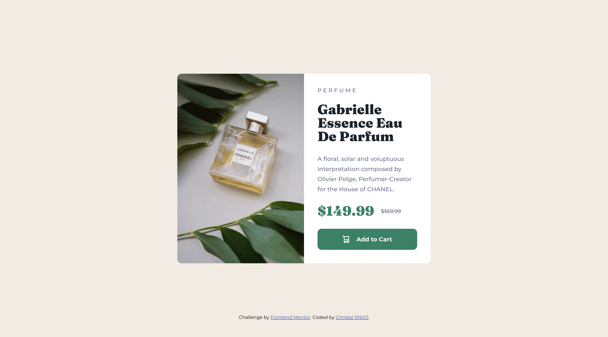

# Frontend Mentor - Product preview card component solution

This is a solution to the [Product preview card component challenge on Frontend Mentor](https://www.frontendmentor.io/challenges/product-preview-card-component-GO7UmttRfa). Frontend Mentor challenges help you improve your coding skills by building realistic projects. 

## Table of contents

- [Overview](#overview)
  - [The challenge](#the-challenge)
  - [Screenshot](#screenshot)
  - [Links](#links)
- [My process](#my-process)
  - [Built with](#built-with)
- [Author](#author)

## Overview

### The challenge

Users should be able to:

- View the optimal layout depending on their device's screen size
- See hover and focus states for interactive elements

### Screenshot

***product preview screenshot desktop***

***product preview screenshot mobile***

### Links

- Solution URL: [frontendmentor solution](https://www.frontendmentor.io/solutions/product-preview-card-component-in-htmlcss-F2T3PLIFuC)
- Live Site URL: [Github page link](https://sylva2002.github.io/product-preview-card-component-main/)

## My process

### Built with

- Semantic HTML5 markup
- CSS custom properties
- Flexbox
- CSS Grid
- Mobile-first workflow

## Author

- GitHub - [Sylva2002](https://github.com/Sylva2002)
- Frontend Mentor - [@Sylva2002](https://www.frontendmentor.io/profile/Sylva2002)

